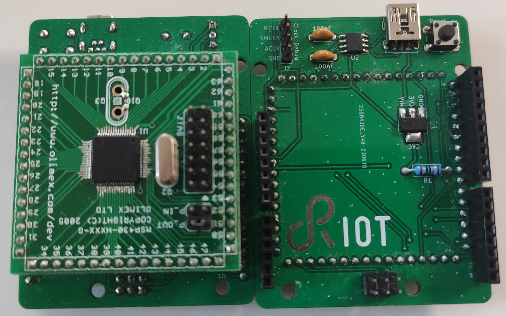

Arduino UNO adapter for Olimex MSP430 Header boards
===================================================

Older MSP430 MCUs can also be obtained in DIP packages, making them extremely
breadboard friendly. The newer high-pin count MSP430 MCUs however are only
available in SMD packages. To still enable breadboard prototyping with those
MCUs, [Olimex Ltd][olimex-homepage] sells open hardware MSP430 breakout boards
named [MSP430 Header Boards][header-boards].

This adapter board can be useful to quickly connect an Arduino UNO compatible
shield to such a header board and/or to connect an USB-UART adapter without
having to use jumper wires.

The board has been developed for the Olimex MSP430-H1611 but also been tested
successfully with the Olimex MSP430-H2618. Chances are good that it will work
with many of the Olimex MSP430 header boards with the same footprint.

Features
--------

- Adapter for Arduino UNO shields
- Integrated UART <--> USB bridge
- Physical reset button
- External resistor for DCO clock source ($R_{OSC}$ in the data sheet)

[olimex-homepage]: https://www.olimex.com/
[header-boards]: https://www.olimex.com/Products/MSP430/Header/
