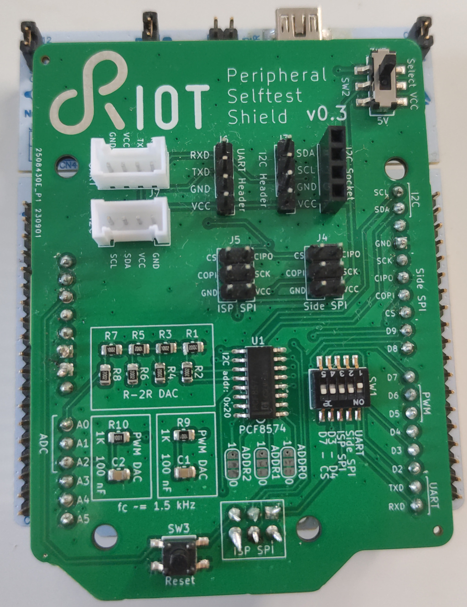

Peripheral Selftesting Shield
=============================

The Peripheral Selftesting Shield is a daughter PCB mating with board compatible
with the Arduino UNO to assist in automatic self-testing of peripheral drivers.

The underlying idea is to loop back output signals of peripheral hardware to
input(s) of the same peripheral (e.g. CIPO to COPI for SPI) or to a different
peripheral (e.g. PWM output via a low-pass filter to an ADC input). This way
the board can generate different output signals and validate if the looped back
input matches the expectations.

The approach is discussed in detail in a [talk at the RIOT summit 2023][talk],
as well in a paper published in the proceedings of the FGSN '23 conference.

[talk]: https://www.youtube.com/watch?v=7k6BapXRG2Q

Versions
--------

| Version   | Folder                    | Description                                           |
|:--------- |:------------------------- |:----------------------------------------------------- |
| v0.1      | --                        | Prototype with flaws, unpublished                     |
| v0.2      | self-soldering-variant    | Uses through-hole parts and view large SMD resistors  |
| v0.3      | smd-variant               | Optimized for ordering with assembly included         |

The version `v0.2` and `v0.3` are fully compatible with each other. The version
`v0.3` is optimized for price when ordering the PCBs with assembly in larger
quantities, while the version `v0.2` is optimized for easier soldering.

Limitations and Bugs
--------------------

### Limitations

- The general approach of loopback testing is unable to detect certain kinds
  of bugs (e.g. UART running at an incorrect symbol rate will still loop back
  correctly, as the loop backed signal will be interpreted at the same (but
  incorrect) symbol rate as it is sent at)
    - This is a deliberate trade-off to reduce setup complexity and costs.
      See [PHiLIP on the HiL][philip-on-the-hil] for an alternative approach to
      testing that can detect the issues missed by loopback testing.

[philip-on-the-hil]: https://dl.acm.org/doi/abs/10.1145/3477040

### Bugs

- Both version v0.2 and v0.3 are missing pull up resistors on the I²C bus
    - The shield works fine on all tested boards that have the internal pull-up
      resistors on the MCU enabled. The exception is the Nucleo-F103RB, since
      STM32F1 cannot use the internal pull-ups when the pins are connected to
      a peripheral
    - The I²C pins are available on header J2. Attaching e.g. an I²C sensor
      shield with pull-ups or suitable resistors mitigates the bug
- When the through-hole pin header J3 of v0.3 is populated, the reset button
  of a Nucleo-64 board may be pressed
    - Clipping of excess solder from the bottom side of J3 pins mitigates the
      issue
    - Also just not populating J3 (as it is optional anyway) is an option
    - Not pressing the shield down the whole way but leaving an 1 mm gap works
      around the issue

Using the Selftesting Shield
----------------------------

Within RIOT, a dedicated [test application][test-app] is provided. The test
can be executed with `make BOARD=<your-board> flash test-with-config`. Check
the README.md for more details.

[test-app]: https://github.com/RIOT-OS/RIOT/tree/master/tests/periph/selftest_shield
